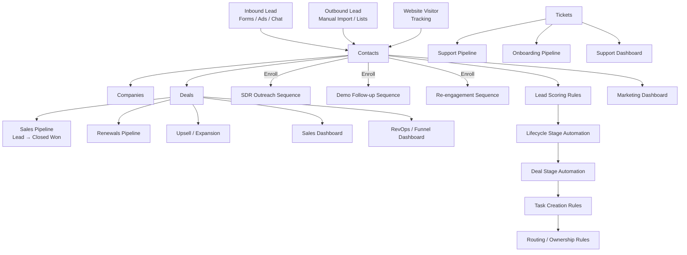

I can—let’s do it in a way you can actually *use*.

Below is a **one-page, everything-in-one HubSpot map** you can screenshot, drop into Notion, or export as a diagram. It shows **pipelines, sequences, automations, dashboards, and rules** all connected.

I’m giving you:

1. **A visual system map (diagram)**
2. **A compact legend + rules**
3. **How to customize it for *your* HubSpot in 5 minutes**

---

## 1️⃣ One-Page HubSpot Visual Map (System View)

You can paste this into any Mermaid-compatible tool (Notion, Obsidian, Mermaid Live) to get a clean visual diagram.

---

## 2️⃣ Legend — How to Read This in 10 Seconds

### 🧱 Core Objects

* **Contacts** = everything starts here
* **Companies** = enrichment + B2B reporting
* **Deals** = revenue logic
* **Tickets** = post-sale & support

### 🔁 Pipelines

* Multiple pipelines ≠ chaos *if* each has:

  * One purpose
  * One owner
  * One dashboard

### ✉️ Sequences

* Triggered **manually or via workflow**
* Never auto-enroll cold contacts without guardrails

### ⚙️ Automation Rules

Order matters:

1. Lead scoring
2. Lifecycle stage
3. Deal stage
4. Tasks
5. Routing

### 📊 Dashboards

* One dashboard per team
* Zero “vanity metrics”
* Every chart answers: *“What do I do next?”*

---

## 3️⃣ Global HubSpot Rules (Put These on the Wall)

**Data rules**

* Lifecycle stage ≠ Deal stage
* One contact = one lifecycle truth
* Sales never edits lead score

**Automation rules**

* No workflow without:

  * Entry criteria
  * Exit logic
  * Owner

**Pipeline rules**

* If it doesn’t forecast → it’s not a sales pipeline
* Closed Lost requires a reason (always)

**Sequence rules**

* Personal step in every sequence
* Auto-unenroll on reply

---

## 4️⃣ Want This Tailored Exactly to You?

I can:

* Customize this for **B2B / SaaS / Agency / RevOps**
* Add **custom objects**
* Convert it into:

  * 🖼️ PNG / PDF
  * 🧠 Notion page
  * 📐 Lucid / Miro layout
  * 🧩 HubSpot training slide

If you want it *perfect*, tell me **one thing**:

> Is this for **Sales-led**, **Marketing-led**, or **Product-led** growth?

I’ll snap it into place.
